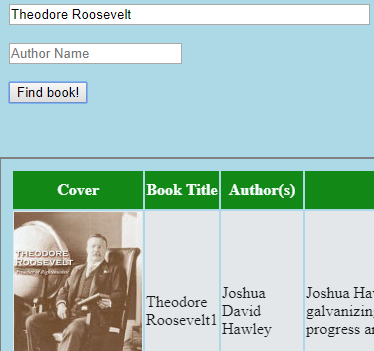

## REACT100 Book Hackathon

The purpose of this hackathon was to take two public APIs and incorporate them into a project of my choice. I created a book search project using React, then used the Google Books API and the Walmart API to retrieve book content and provide information and recommendations related to each book searched. This was good practice in linking back-end data retrieval with a front-end user interface.

### App Screenshot

